# XYamp
Deflection amplifier to mod a CRT into an XY monitor. Mainly designed for the SONY watchman and the SCOPETREX.

This document is written mostly in Japanese. If necessary, please use a translation service such as DeepL (I recommend this) or Google.

# 概要
白黒CRTをXYモニターとして使うための回路です．[SCOPETREX](https://github.com/schlae/scopetrex)の出力をSONY watchmanに表示させるために作りました．
回路は[sony-scopeman](https://github.com/lucysrausch/sony-scopeman)とVectrex Seervice Manualを参考にしながら独自に描きましたが，私はアナログ回路は超初心者なのでおかしなところがあるかもしれません．

watchman FD-10
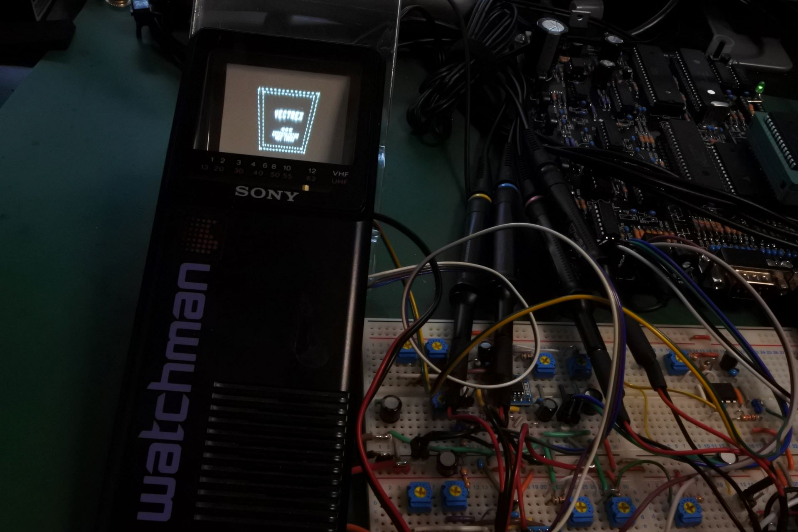

watchman FD-40
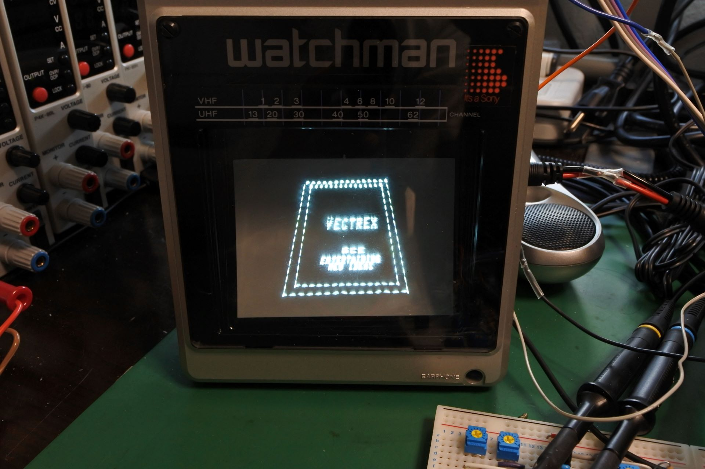

主な構成要素は下記の3種類の回路です．
- X, Y信号で偏向コイルを駆動するためのアンプ
- Z信号(輝度信号)でG1グリッドを駆動するためのアンプ
    - WatchmanのCRTはカソードではなくG1で輝度を調整しています．
- フライバックトランス(高電圧生成)用の16kHzの信号発振器

# 回路の説明
## XY軸(偏向)用アンプ
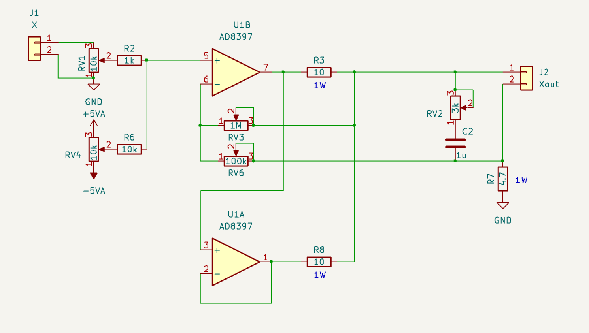

watchmanのCRTではX軸は±500mA程度，Y軸は±100mA(FD-10), 0〜150mA(FD-40)程度の電流を流す必要があるようでした．[sony-scopeman](https://github.com/lucysrausch/sony-scopeman)ではエミッタフォロワで実装しているようでしたが，私はアナログ回路に疎いのでオペアンプ直結で実装することにしました．その方が部品数も少なく済むし．ちなみにVectrexは大容量オペアンプ(LM379)が使われています．
- 動作電圧±5V
- 小型パッケージ
- 入手が容易

という基準で探してみたところ，秋月で入手可能なAD8397ARDZが良さそうだったのでこれを使うことにしました．1回路だと容量が足りないので，2回路並列で使っています．
安直に2回路並列にして容量を増やせるのかどうか疑問だったのですが，
「オペアンプ 大容量」でググって出てきた下記の情報を見つけて試してみたところ問題無く動きました．

- https://www.digikey.jp/ja/articles/control-amplify-high-voltages-effectively-high-voltage-op-amp
    - 元のデータシートはこちら https://www.ti.com/product/ja-jp/OPA454    

Y軸の方は1回路でも十分なのですが，余っているので並列にしています．

### 歪みの補償について
最初，単純に信号を増幅してコイルに継げるだけでは歪みまくってまともな画像にならず途方に暮れていたのですが，
[Homebrew CRT Deflection Coil Compensation](https://www.youtube.com/watch?v=PtxpeOIiFUw)
に，抵抗とコンデンサをコイルと並列に継げると良いという情報を見つけ，試してみたところうまくいきました．

オペアンプの帰還信号はコイルの前だけでは不十分で，通過後の信号と両方使っています．Vectrexの回路でそうなっているので試してみたらうまくいったという次第です．(私はこのあたりの理屈はまだ理解できていません．)

一応動いてはいますが，まだ若干発振しているようで，修正の余地がありそうです．

## Z軸(輝度)用アンプ
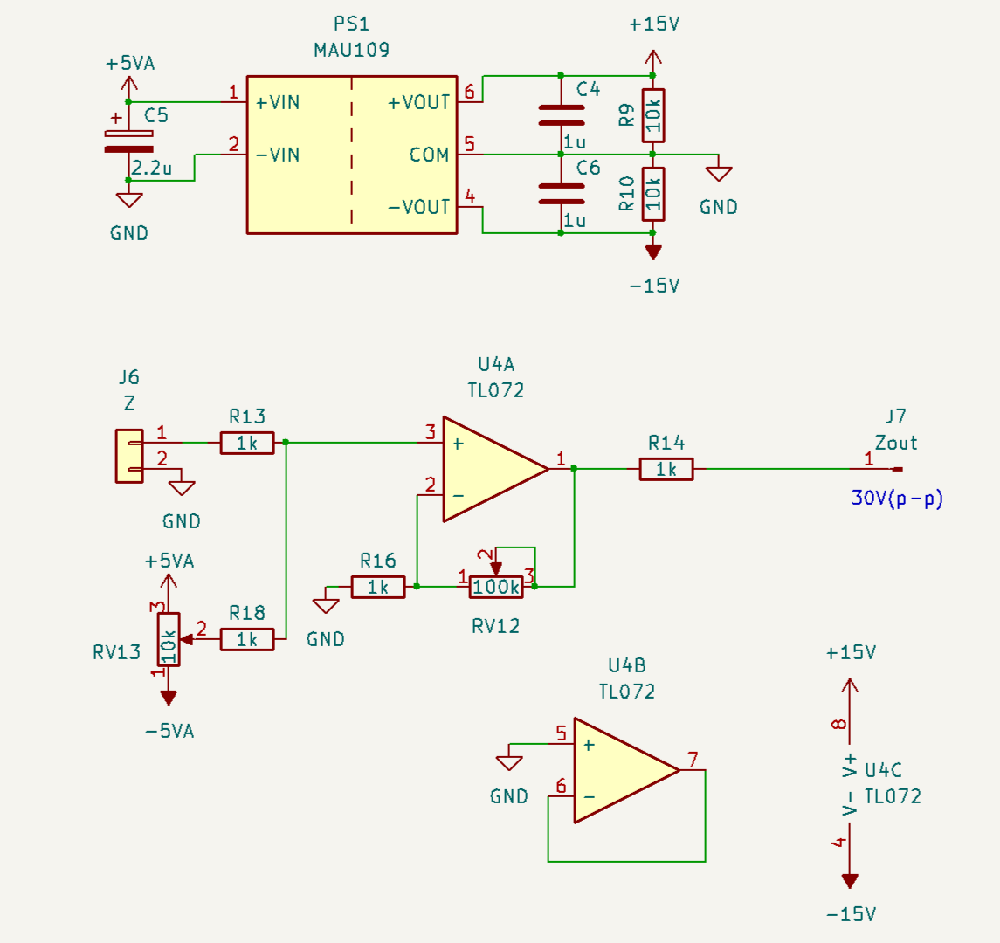

watchmanのCRTはG1グリッドで輝度を調整しているようです．
sony-scopemanでは3.3V単電源のオペアンプの出力を継げているようだったのでマネしてみたのですがうまくいかず，いろいろ調べてみたところG1は±20Vぐらいの信号のようだったので±15Vのオペアンプを使ってScopetrexのZ信号を増幅することにしました．

ちなみに，改造前のwatchmanにNTSCのカラーバーを入力したときのG1グリッドの信号はこんな感じでした．(一番下のピンク色の階段状の波形(ch3, 50V/div))

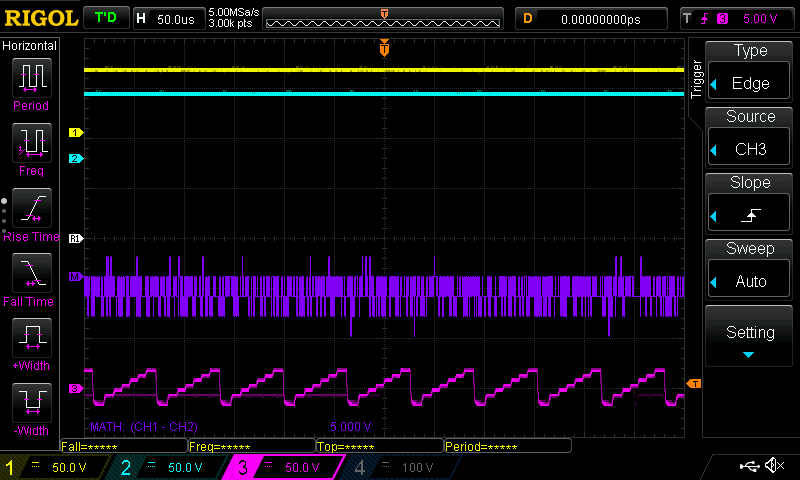

## フライバック信号発振器
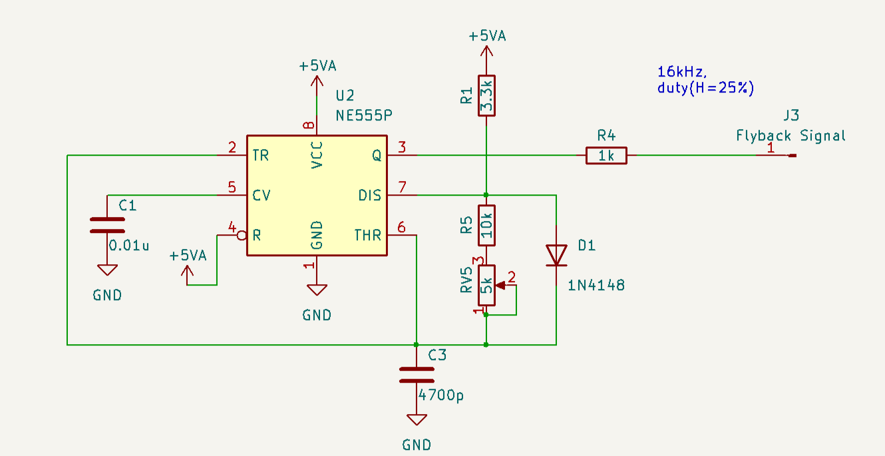

フライバックトランス用のパルス信号です．sony-scopemanではESP32のPWM(16kHz, duty 40%)信号が使われています．
15.75kHzの矩形波で良さそうだったので555を使うことにしました．watchmanの信号を観測したところデューティ比は25%ぐらいだったのでそのぐらいにしました．
ちなみにVectrexでも555が使われているようです．

## BOM
暫定版なので，もしかしたら回路図と合ってないかもしれません．

|Reference|Qty|Value|Memo|
|---|---|---|---|
|C1|1|0.01u||
|C2, C4, C6, C7|4|1u||
|C3|1|4700p||
|C5|1|2.2u||
|C8, C9, C12, C13|4|47u||
|C10, C11, C14, C15|4|0.1u||
|D1|1|1N4148||
|J1|1||X|
|J2|1||Xout|
|J3|1||Flyback Signal|
|J4|1||Y|
|J5|1||Yout|
|J6|1||Z|
|J7|1|Zout||
|J8|1|Conn_01x03|power|
|PS1|1|MAU109||
|R1|1|3.3k||
|R2, R4, R11, R13, R14, R16, R18|7|1k||
|R3, R8, R12, R19|4|10||
|R5, R6, R9, R10, R15|5|10k||
|R7, R17|2|4.7||
|RV1, RV4, RV7, RV10, RV13|5|10k||
|RV2, RV8|2|3k||
|RV3, RV9|2|1M||
|RV5|1|5k||
|RV6, RV12|2|100k||
|RV11|1|1k||
|U1, U3|2|AD8397||
|U2|1|NE555P||
|U4|1|TL072||

# 接続方法
## watchman FD-10
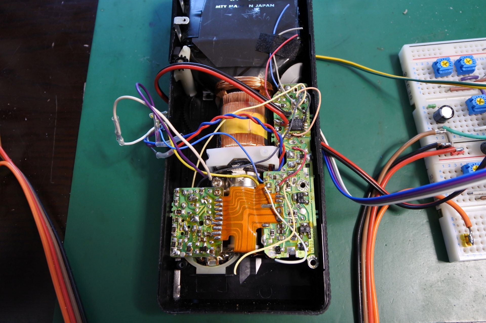

FD-10の信号線に関しては[sony-scopeman](https://github.com/lucysrausch/sony-scopeman)を参考にしました．
- X yoke: CRTから伸びている赤(+)と青(-)
- Y yoke: CRTから伸びている白(+)と紫(-)
- G1: CRTから伸びている黄色
- flyback signal: 基板上の青
- 電源: 基板上の紫(+5V)と黒(GND)．(上記写真では赤と黒)

## watchman FD-40
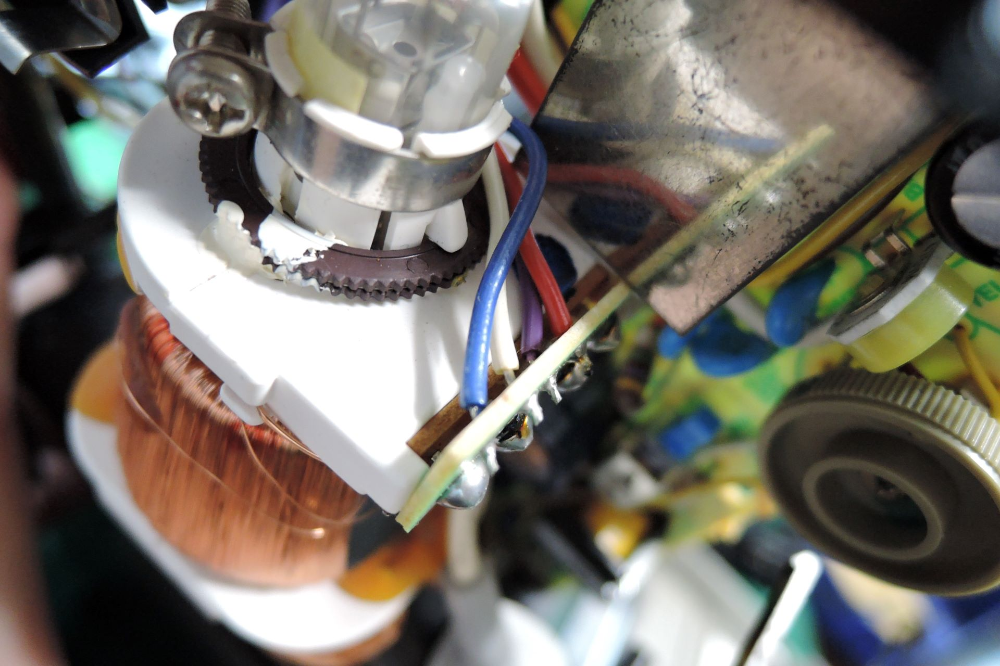
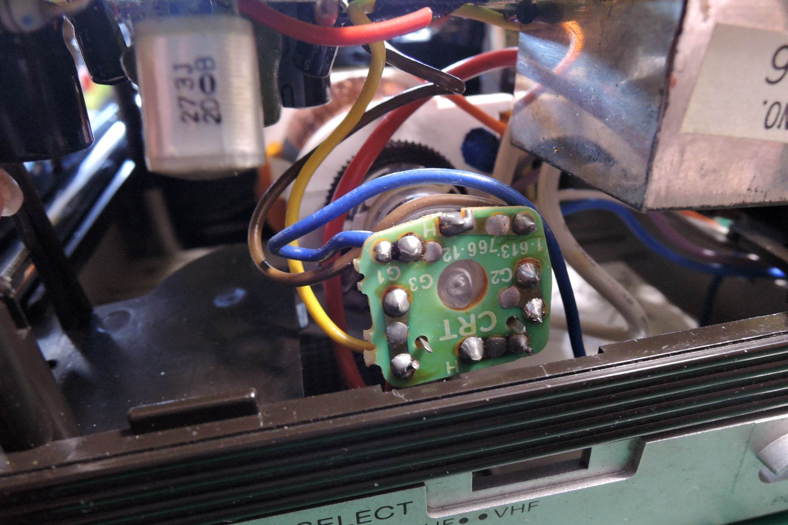

- X yoke: コイル横の基板の赤(+)と青(-)
- Y yoke: コイル横の基板の白(+)と紫(-)
- G1: CRT根元の基板に表記あり
- 電源: +5Vだけでいいのか未確認なので，現状+6VをDCinから供給しています．
- GNDはどこか適当なところに接続

- flyback signal: 基板上R509とR801を外して，R801のトランジスタ側(Q801のベース)に接続
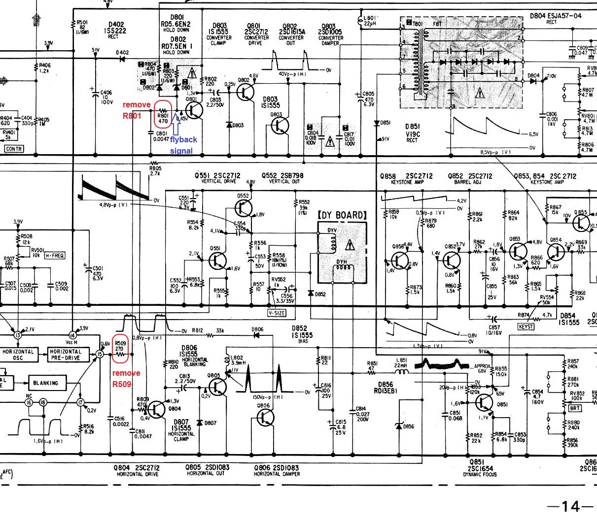
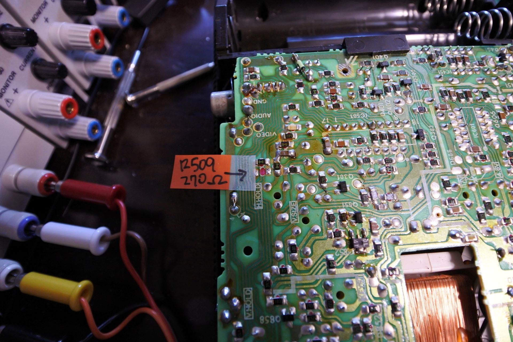
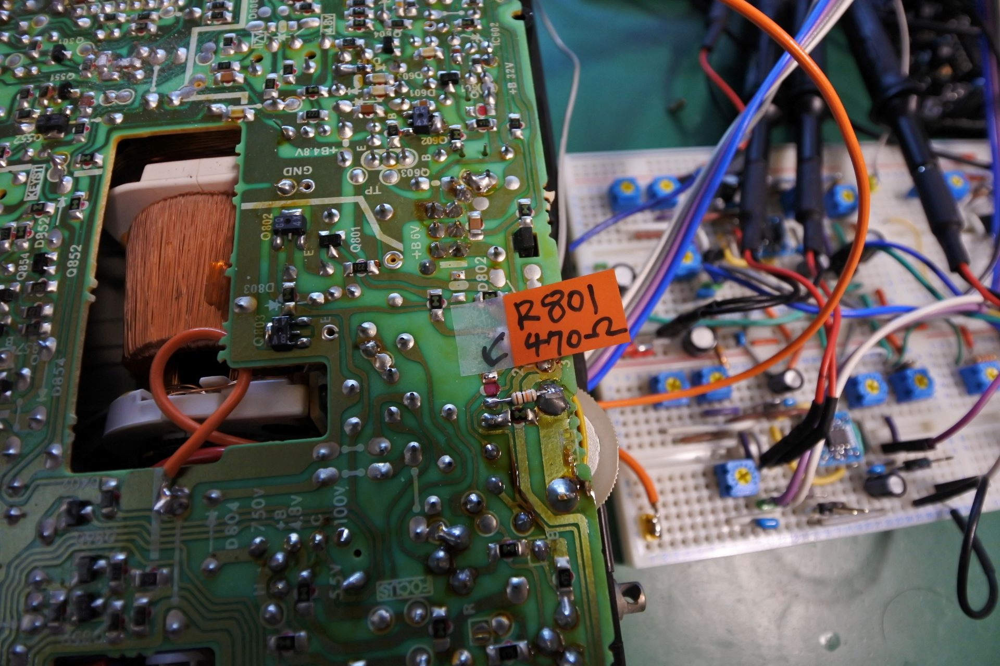

# 調整方法
調整箇所は下記の通り．
## アンプ側
- X, Yの入力振幅とオフセット
- X, Yの偏向コイルの補償
- X, Yの帰還信号(経路1)
- X, Yの帰還信号(経路2)
- Zの入力振幅とオフセット
- Zの倍率
- フライバック信号の周波数
    - 16kHzぐらいにする
## watchman側
- 輝度
- フォーカス

# ブレッドボード版プロトタイプ
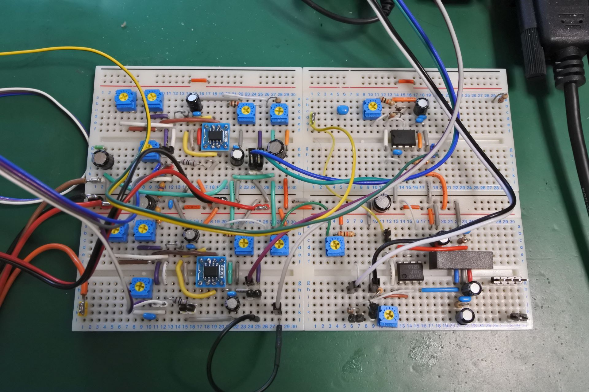
- とりあえずブレッドボードに組んで動作しました．
- ブレッドボードなのが原因かは不明ですが信号が若干揺れます．

# 動画
動作している様子です．

## その他の画像
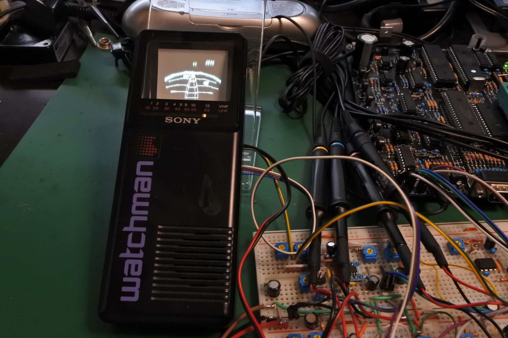
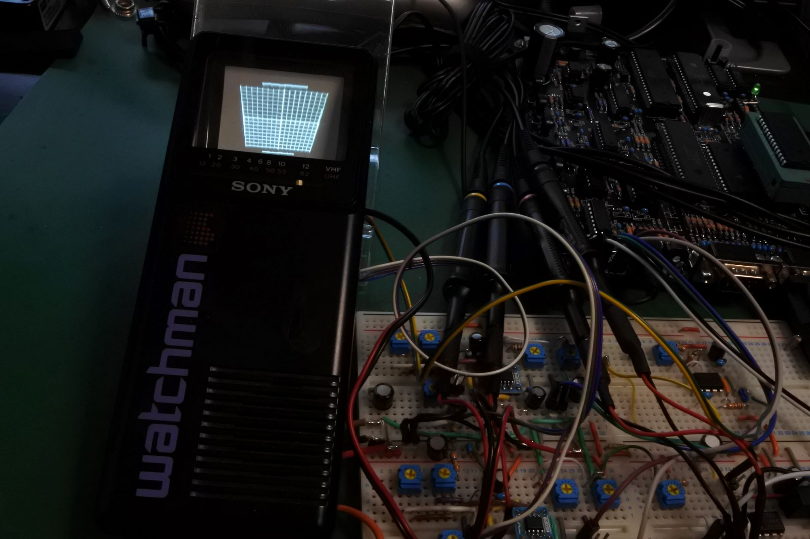

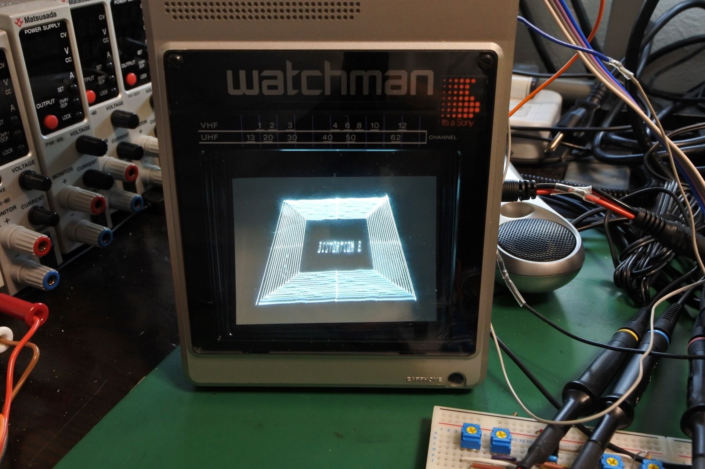
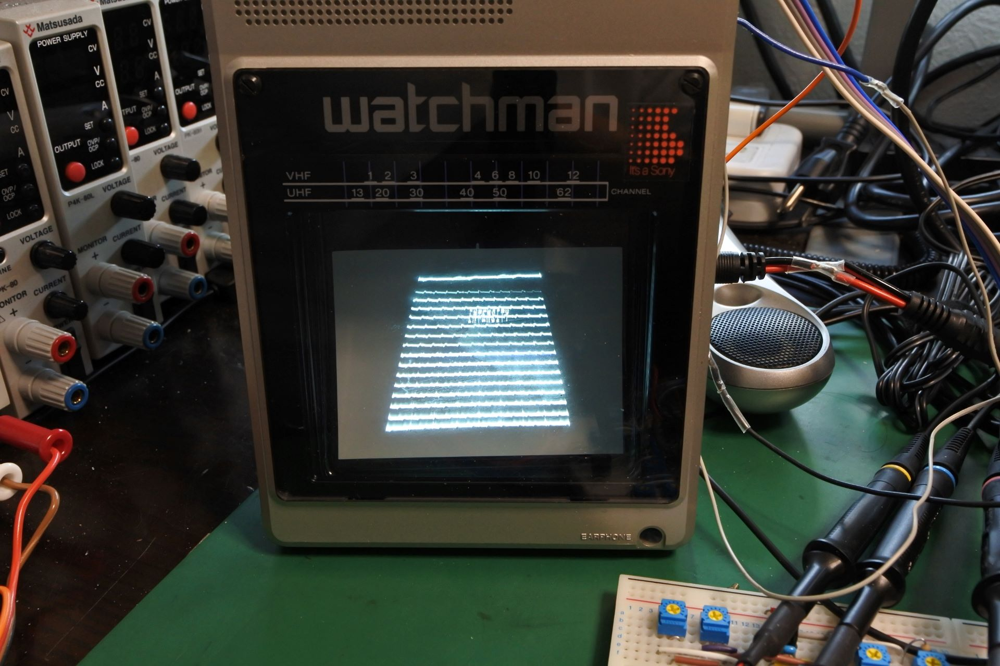

# ToDo
- 基板作成
- 電源はバッテリーにしたい．
- vectrex部分もwatchmanの筐体に内蔵したい．
    - https://github.com/ryomuk/tangnano20k-vectrex みたいなやつ?

# 参考にした文献，サイト等
### watchman関連
- https://github.com/lucysrausch/sony-scopeman
- https://vintage-technics.ru/Eng-Sony_FD-40A.htm
    - FD-40Aの回路図あり．
    - 検索したらFD-10やFD-20の回路図もネット上にあるみたい．

### 偏向コイルの補償について
- https://www.youtube.com/watch?v=PtxpeOIiFUw

### Vectrex, Scopetrex関連
- https://github.com/schlae/scopetrex
- https://www.e-basteln.de/arcade/asteroids/monitor/

### XYモニター関連
- https://www.jmargolin.com/xy/xymon.htm

### オペアンプの並列接続について
「オペアンプ 大容量」でググって出てきたのがこちら．
- https://www.digikey.jp/ja/articles/control-amplify-high-voltages-effectively-high-voltage-op-amp
    - 元のデータシートはこちら https://www.ti.com/product/ja-jp/OPA454    

# 更新履歴
- 2023/10/19: 初版公開

