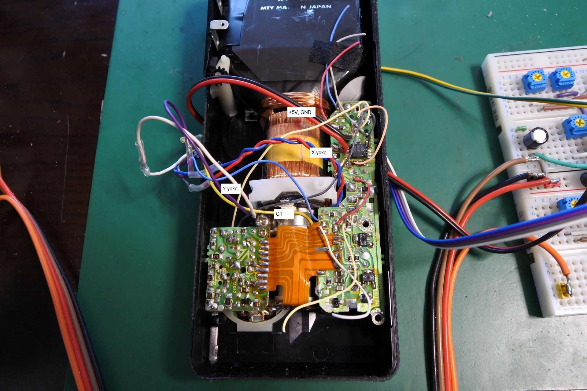
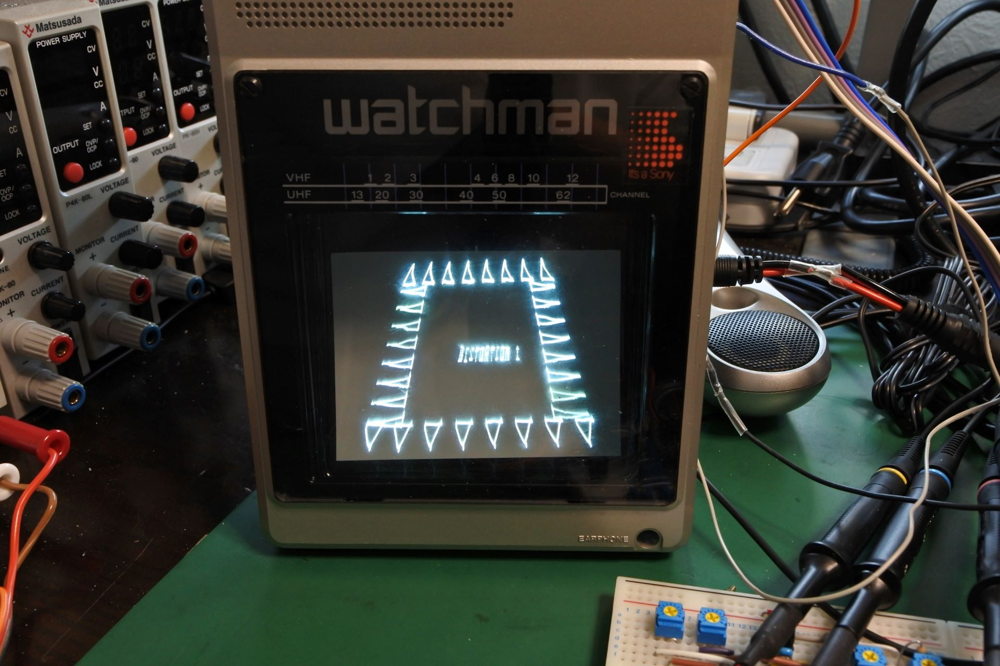

# XYamp
Deflection amplifier to mod a CRT into an XY monitor. Mainly designed for the SONY watchman and the SCOPETREX.

This document is written mostly in Japanese. If necessary, please use a translation service such as DeepL (I recommend this) or Google.

# 概要
白黒CRTをXYモニターとして使うための回路です．SCOPETREX( https://github.com/schlae/scopetrex )の出力をSONY watchmanに表示させるために作りました．

主な構成要素は下記の3種類の回路です．
- X, Y信号で偏向コイルを駆動するためのアンプ
- Z信号(輝度信号)でG1グリッドを駆動するためのアンプ
    - WatchmanのCRTはカソードではなくG1で輝度を調整しています．
- フライバックトランス(高電圧生成)用の16kHzの信号発振器

# 動画
動作している様子です．

# 回路の説明
## XY軸(偏向)用アンプ

## Z軸(輝度)用アンプ

## フライバック信号発振器

## BOM

# 接続方法
## watchman FD-10

## watchman FD-40

# 調整方法
調整箇所は下記の通り．
## アンプ側
- X, Yの入力振幅とオフセット
- X, Yの偏向コイルの補償
- X, Yの帰還信号(経路1)
- X, Yの帰還信号(経路2)
- Zの入力振幅とオフセット
- Zの倍率
- フライバック信号の周波数
    - 16kHzぐらいにする
## watchman側
- 輝度
- フォーカス

# ブレッドボード版プロトタイプ

- とりあえずブレッドボードに組んで動作しました．
- ブレッドボードなのが原因かは不明ですが信号が若干揺れます．

## 画像

# ToDo
- 基板作成
- 電源はバッテリーにしたい．
- vectrex部分もwatchmanの筐体に内蔵したい．
    - https://github.com/ryomuk/tangnano20k-vectrex みたいなやつ?

# 参考にした文献，サイト等
## watchman関連
- https://github.com/lucysrausch/sony-scopeman
- https://vintage-technics.ru/Eng-Sony_FD-40A.htm
    - FD-40Aの回路図あり．
    - 検索したらFD-10やFD-20の回路図もネット上にあるみたい．

## 偏向コイルの補償について
- https://www.youtube.com/watch?v=PtxpeOIiFUw

## Vectrex, Scopetrex関連
- https://github.com/schlae/scopetrex
- https://www.e-basteln.de/arcade/asteroids/monitor/

## XYモニター関連
- https://www.jmargolin.com/xy/xymon.htm

## オペアンプの並列接続について
「オペアンプ 大容量」でググって出てきたのがこちら．
- https://www.digikey.jp/ja/articles/control-amplify-high-voltages-effectively-high-voltage-op-amp
    - 元のデータシートはこちら https://www.ti.com/product/ja-jp/OPA454    

# 更新履歴
- 2023/10/18: 初版公開

